```mermaid
flowchart TB
    subgraph upstream["Dependants (1)"]
        P1["<b>📦&nbsp;BlazorBlocks.Test.WASM.csproj</b><br/><small>net9.0</small>"]
        click P1 "#testblazorblockstestwasmblazorblockstestwasmcsproj"
    end
    subgraph current["BlazorBlocks.csproj"]
        MAIN["<b>📦&nbsp;BlazorBlocks.csproj</b><br/><small>net8.0</small>"]
        click MAIN "#blazorblocksblazorblockscsproj"
    end
    P1 --> MAIN

```

```mermaid
flowchart TB
    subgraph current["BlazorBlocks.Test.WASM.csproj"]
        MAIN["<b>📦&nbsp;BlazorBlocks.Test.WASM.csproj</b><br/><small>net9.0</small>"]
        click MAIN "#testblazorblockstestwasmblazorblockstestwasmcsproj"
    end
    subgraph downstream["Dependencies (1"]
        P2["<b>📦&nbsp;BlazorBlocks.csproj</b><br/><small>net8.0</small>"]
        click P2 "#blazorblocksblazorblockscsproj"
    end
    MAIN --> P2

```

# Projects and dependencies analysis

This document provides a comprehensive overview of the projects and their dependencies in the context of upgrading to .NET 9.0.

## Table of Contents

- [Projects Relationship Graph](#projects-relationship-graph)
- [Project Details](#project-details)

  - [BlazorBlocks\BlazorBlocks.csproj](#blazorblocksblazorblockscsproj)
  - [Test\BlazorBlocks.Test.WASM\BlazorBlocks.Test.WASM.csproj](#testblazorblockstestwasmblazorblockstestwasmcsproj)
- [Aggregate NuGet packages details](#aggregate-nuget-packages-details)

## Projects Relationship Graph

Legend:
📦 SDK-style project
⚙️ Classic project

```mermaid
flowchart LR
    P1["<b>📦&nbsp;BlazorBlocks.Test.WASM.csproj</b><br/><small>net9.0</small>"]
    P2["<b>📦&nbsp;BlazorBlocks.csproj</b><br/><small>net8.0</small>"]
    P1 --> P2
    click P1 "#testblazorblockstestwasmblazorblockstestwasmcsproj"
    click P2 "#blazorblocksblazorblockscsproj"

```

## Project Details

### BlazorBlocks\BlazorBlocks.csproj

#### Project Info

- **Current Target Framework:** net8.0
- **Proposed Target Framework:** net10.0
- **SDK-style**: True
- **Project Kind:** ClassLibrary
- **Dependencies**: 0
- **Dependants**: 1
- **Number of Files**: 43
- **Lines of Code**: 856

#### Dependency Graph

Legend:
📦 SDK-style project
⚙️ Classic project

#### Project Package References

| Package | Type | Current Version | Suggested Version | Description |
| :--- | :---: | :---: | :---: | :--- |
| Microsoft.AspNetCore.Components.Web | Explicit | 8.0.17 | 10.0.0 | NuGet package upgrade is recommended |

### Test\BlazorBlocks.Test.WASM\BlazorBlocks.Test.WASM.csproj

#### Project Info

- **Current Target Framework:** net9.0
- **Proposed Target Framework:** net10.0
- **SDK-style**: True
- **Project Kind:** AspNetCore
- **Dependencies**: 1
- **Dependants**: 0
- **Number of Files**: 24
- **Lines of Code**: 44

#### Dependency Graph

Legend:
📦 SDK-style project
⚙️ Classic project

#### Project Package References

| Package | Type | Current Version | Suggested Version | Description |
| :--- | :---: | :---: | :---: | :--- |
| Microsoft.AspNetCore.Components.WebAssembly | Explicit | 9.0.5 | 10.0.0 | NuGet package upgrade is recommended |
| Microsoft.AspNetCore.Components.WebAssembly.DevServer | Explicit | 9.0.5 | 10.0.0 | NuGet package upgrade is recommended |

## Aggregate NuGet packages details

| Package | Current Version | Suggested Version | Projects | Description |
| :--- | :---: | :---: | :--- | :--- |
| Microsoft.AspNetCore.Components.Web | 8.0.17 | 10.0.0 | [BlazorBlocks.csproj](#blazorblockscsproj) | NuGet package upgrade is recommended |
| Microsoft.AspNetCore.Components.WebAssembly | 9.0.5 | 10.0.0 | [BlazorBlocks.Test.WASM.csproj](#blazorblockstestwasmcsproj) | NuGet package upgrade is recommended |
| Microsoft.AspNetCore.Components.WebAssembly.DevServer | 9.0.5 | 10.0.0 | [BlazorBlocks.Test.WASM.csproj](#blazorblockstestwasmcsproj) | NuGet package upgrade is recommended |

