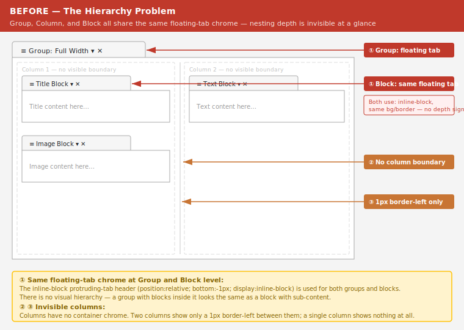
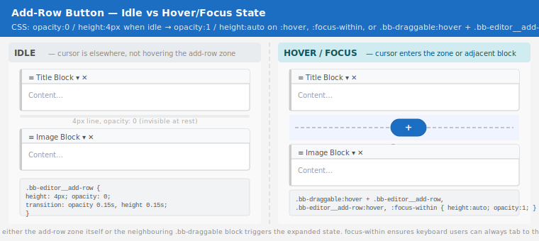

# BlazorBlocks Editor — UI/UX Improvement Suggestions

> **Related issue:** [#6 — Editor styling](https://github.com/ThindalTV/BlazorBlocks/issues/6)  
> **Author:** Naomi (UI/UX Designer)  
> **Scope:** Visual polish, hierarchy legibility, interaction quality — no code changes in this document.

---

## Context & Constraints

BlazorBlocks is a **component library**, not a standalone app. The `<BlazorBlocksEditor>` can be dropped into any Blazor host — a CMS admin, a Razor Pages form, a WASM SPA. This shapes every suggestion here:

- **No layout assumptions.** The editor cannot dictate page width, sidebar presence, or overall page chrome.
- **CSS-variable-first.** All theming already flows through `--bb-*` custom properties — suggestions build on this, not around it.
- **No new heavy dependencies.** No CSS frameworks, no JS animation libraries.
- **Utility-class compatible.** Suggestions describe intent via class modifiers and variable tweaks, so hosts using Tailwind, Bootstrap utility classes, or plain CSS can all align.

The editor has a three-level nesting hierarchy:

```
BlazorBlocksEditor
  └── EditorGroup       (a "row" — groups columns together, draggable)
        └── EditorColumn    (a flex column within the group)
              └── DraggableContainer → BlockContainer   (a single content block)
```

The core problem is that all three levels are currently rendered using the **same visual pattern**: a floating tab-style header above a bordered content box. At a glance, groups, columns, and blocks look like variations of the same thing rather than a clear containment hierarchy. The suggestions below address that.

> **Mockup — current state:**
> 

---

## 1. Differentiate the Three Nesting Levels Visually

### The problem

`DraggableContainer` is used for both **groups** (`.bb-draggable--group`) and **blocks** (`.bb-draggable--block`). The only distinction today is a slightly darker background on groups (`--bb-color-background-light` vs `--bb-color-background-white`). The tab-on-top-of-a-box pattern is identical for both.

Columns have no chrome of their own — they rely on a thin `border-left` separator that only appears between adjacent columns. A single-column group has no visible column boundary at all.

### Suggestions

#### Groups — use a full-width header stripe, not a floating tab

Replace the inline-block tab header with a **full-width banner** across the top of the group. This communicates "this is a top-level section" clearly and allows the group name and controls to sit in a predictable, scannable position.

```
┌─────────────────────────────────────────────────────┐
│ ≡  Group: Full Width                         ▼  ✕  │  ← full-width header bar
├─────────────────────────────────────────────────────┤
│  [Column 1]          │  [Column 2]                  │
│   block              │   block                      │
│   block              │                              │
└─────────────────────────────────────────────────────┘
```

CSS direction (no new variables needed — uses existing tokens):

```css
/* Replace the floating-tab style with a full stripe */
.bb-draggable--group > .bb-draggable__header {
    position: static;          /* remove the bottom: -1px trick */
    display: flex;             /* full-width instead of inline-block */
    width: 100%;
    border-radius: var(--bb-border-radius-md) var(--bb-border-radius-md) 0 0;
    border-bottom: none;
    background-color: var(--bb-color-neutral-200);
    box-sizing: border-box;
}

.bb-draggable--group > .bb-draggable__content {
    border-radius: 0 0 var(--bb-border-radius-md) var(--bb-border-radius-md);
    border-top: none;          /* header now covers the top edge */
}
```

#### Groups — add a left-accent color stripe

A colored left border on the group container gives it an unmistakable "section" identity and makes groups visually pop out of the page background. A second accent color for blocks makes the levels immediately distinguishable even when collapsed.

```css
.bb-draggable--group {
    border-left: 3px solid var(--bb-color-primary);
}

.bb-draggable--block {
    border-left: 3px solid var(--bb-color-border-light);
}
```

This is a two-line addition that has high clarity impact with no layout disruption.

#### Columns — give each column a visible boundary

Currently a column is invisible until it contains at least two siblings (the `border-left` only appears between adjacent columns). Add a light background and subtle border to each column so the structural grid is always readable:

```css
.bb-editor__column {
    background-color: var(--bb-color-background-white);
    border: var(--bb-border-width) solid var(--bb-color-border-light);
    border-radius: var(--bb-border-radius-sm);
    min-height: 80px;         /* already set at 100px in blazorblocks-editor.css — keep it */
}
```

Remove the `border-left` separator in favour of a small `gap` on the group content flex container. This avoids the "first column has no left edge" asymmetry.

```css
.bb-editor__group-content {
    gap: var(--bb-spacing-sm);   /* replaces the border-left-on-second-child approach */
}

.bb-editor__column + .bb-editor__column {
    border-left: none;  /* remove — gap handles separation now */
}
```

#### Blocks — lighter, content-forward

Blocks should feel like _content cards_, not structural containers. The tab-header pattern on blocks currently competes visually with the group header. Consider a subtler header: no protruding tab, just a thin top bar integrated into the block's border.

```css
.bb-draggable--block > .bb-draggable__header {
    position: static;
    display: flex;
    width: 100%;
    padding: var(--bb-spacing-xs) var(--bb-spacing-sm);
    background-color: var(--bb-color-neutral-100);
    border-radius: var(--bb-border-radius-sm) var(--bb-border-radius-sm) 0 0;
    border-bottom: var(--bb-border-width) solid var(--bb-color-border-light);
    box-sizing: border-box;
}

.bb-draggable--block > .bb-draggable__content {
    border-top: none;
    border-radius: 0 0 var(--bb-border-radius-sm) var(--bb-border-radius-sm);
}
```

> **Mockup — proposed hierarchy:**
> 

---

## 2. Reduce Noise from Always-Visible Add Rows

### The problem

`AddBlockRow` renders a "Group +" or "Block +" row with a horizontal rule and a labelled button **between every item** in the editor at all times. With several groups each containing several blocks, this creates a dense grid of add-affordances that competes with the content itself.

### Suggestions

#### Make add-rows appear on hover/focus, not always

An add-row should be a low-profile zone. Show the full button treatment only when the user's cursor enters the zone. When idle, render just a very thin line (2px) as a visual placeholder.

```css
/* Idle state — thin rule only */
.bb-editor__add-row {
    height: 4px;
    margin-block: var(--bb-spacing-xs);
    opacity: 0;
    transition: opacity var(--bb-transition-fast), height var(--bb-transition-fast);
}

/* Visible on hover of the row itself or its neighbours */
.bb-draggable:hover + .bb-editor__add-row,
.bb-editor__add-row:hover,
.bb-editor__add-row:focus-within {
    height: auto;
    opacity: 1;
}
```

This keeps add-rows discoverable and accessible (focus-within ensures keyboard users can still reach them) while dramatically reducing visual noise in complex documents.

> **Mockup — add-row idle vs hover:**
> 

#### Distinguish group add-rows from block add-rows

Currently both use identical visual treatment with only a text label difference. The existing modifier classes (`.bb-editor__add-row-button--group` for circles, `.bb-editor__add-row-button--block` for squares) are good — lean into them more:

- **Group add-row:** Keep the pill/circle button, but make the horizontal rule dashed and slightly thicker. Dashed = "structural boundary."
- **Block add-row:** Use a thinner solid rule. Solid = "content item boundary."

```css
/* Group-level add row */
.bb-draggable--group ~ .bb-editor__add-row .bb-editor__add-row-sides {
    border-bottom-style: dashed;
    border-bottom-width: 2px;
}

/* Block-level add row (within column) — keep existing thin solid style */
```

---

## 3. Collapse/Expand — Improve the Icon and Interaction

### The problem

The collapse button uses a four-arrow "expand/compress" SVG icon from the icon set. This reads as "resize" or "fullscreen toggle", not "show/hide content". Users may not recognise it as a toggle for the section content below.

### Suggestions

#### Use a chevron icon instead

A downward chevron (▾) for expanded and a rightward chevron (▸) for collapsed is the industry-standard convention for tree nodes, accordions, and collapsible sections. It is immediately understood without any tooltip.

The icon swap can be done inline in `CollapseButton.razor` — the component already has a conditional render based on `Collapsed`. Replace the current SVGs with a simple chevron-down / chevron-right pair.

#### Animate the transition

Add a CSS rotation transition so the chevron smoothly rotates from pointing right (collapsed) to pointing down (expanded). This provides motion feedback without JavaScript.

```css
.collapseButton svg {
    transition: transform var(--bb-transition-fast);
}

.collapseButton[aria-expanded="false"] svg {
    transform: rotate(-90deg);
}
```

This requires setting `aria-expanded` on the button element — a worthwhile accessibility improvement too (see Section 6 below).

#### Collapsed state should visually persist the header

When a group or block is collapsed, its content disappears (`bb-draggable__content--collapsed` applies `display: none`). But the header floats disconnected without a bottom border. Add a bottom border to the header when content is hidden:

```css
.bb-draggable__content--collapsed + .bb-draggable__header,
.bb-draggable:has(.bb-draggable__content--collapsed) .bb-draggable__header {
    border-bottom: var(--bb-border-width) solid var(--bb-color-border-medium);
    border-radius: var(--bb-border-radius-md);
}
```

---

## 4. Drag & Drop — Clearer Affordances

### The problem

- The drag handle is a 24×24 SVG icon. When `Draggable="false"` (a group with only one row), the handle is hidden but no visual difference communicates that the group is _not_ draggable.
- Drop zones during a drag (`bb-editor__add-row--droppable`) turn green with `opacity: 0.5` and a hardcoded `#080` colour — this is the only place in the codebase with a hardcoded colour that doesn't use the design token system.
- The drag handle has no hover feedback.

### Suggestions

#### Add a hover state to the drag handle

```css
.bb-draggable__handle:hover svg {
    color: var(--bb-color-primary);
}
```

#### Replace the hardcoded drop-zone colour with a token

Add to `blazorblocks-variables.css`:

```css
--bb-color-drop-target: #26b050;  /* reuses the existing success green */
```

Update in `AddBlockRow.razor.css`:

```css
.bb-editor__add-row--droppable {
    background-color: var(--bb-color-drop-target);
    /* remove opacity reduction — it makes the green appear muddy */
    opacity: 1;
}
```

#### Add a cursor hint when not draggable

When only one group exists (and `Draggable` is false), show `cursor: default` and a slightly muted handle:

```css
.bb-draggable__handle[draggable="false"],
.bb-draggable__handle:not([draggable]) {
    cursor: default;
    opacity: var(--bb-opacity-disabled);
}
```

---

## 5. Dialog UX — Consistency and Visual Weight

### The problem

The dialogs (`Dialog.razor`, `NewGroupDialog.razor`) use the native `<dialog>` HTML element (good for accessibility), but their content styles are inconsistent:

- `NewGroupDialog` uses Bootstrap-specific classes (`btn btn-info me-2`) that will break in non-Bootstrap hosts.
- `Dialog.razor` has a full commented-out custom implementation (the `.bb-dialog-overlay` pattern), suggesting the current approach was a transitional choice.
- The native `<dialog>` has no visual styling beyond what the browser provides — no padding, no rounded corners, no backdrop blur.

### Suggestions

#### Style the native `<dialog>` with `bb-*` tokens

Add rules scoped to `.bb-editor` so they don't bleed into the host application:

```css
/* In blazorblocks-editor.css */
.bb-editor dialog,
dialog.bb-dialog {
    border: var(--bb-border-width) solid var(--bb-color-border-medium);
    border-radius: var(--bb-border-radius-md);
    padding: var(--bb-spacing-md);
    max-width: 480px;
    width: 90vw;
    box-shadow: 0 4px 24px rgba(0, 0, 0, 0.15);
}

.bb-editor dialog::backdrop {
    background-color: rgba(0, 0, 0, 0.4);
    backdrop-filter: blur(2px);
}

.bb-editor dialog h2 {
    margin: 0 0 var(--bb-spacing-md);
    font-size: var(--bb-font-size-lg);
    font-weight: 600;
    border-bottom: var(--bb-border-width) solid var(--bb-color-border-light);
    padding-bottom: var(--bb-spacing-sm);
}
```

#### Replace Bootstrap classes in NewGroupDialog with `bb-button` equivalents

The `BlazorBlocks.csproj` already defines `bb-button` semantics in `blazorblocks-components.css`. Use those for the group selection buttons instead of `btn btn-info`, so the editor works correctly in any host.

#### Add a close button to the dialog chrome

The native `<dialog>` has no close affordance beyond the `OnClose` callback. Add a close button (×) in the top-right corner of the dialog header, styled consistently with the delete button pattern already used in `DraggableContainer`.

---

## 6. Empty States

### The problem

- An empty column shows nothing — no affordance that you can add content to it. `min-height: 100px` keeps it from collapsing, but it's a blank void.
- An empty editor (zero groups) shows only the top-level `AddBlockRow`. There's no explanatory text or visual call-to-action.

### Suggestions

#### Empty column — add a centred placeholder

```css
.bb-editor__column:empty::before {
    content: "Drop a block here";
    display: flex;
    align-items: center;
    justify-content: center;
    height: 100%;
    min-height: 80px;
    color: var(--bb-color-neutral-900);
    font-size: var(--bb-font-size-base);
    opacity: 0.5;
    font-style: italic;
}
```

Note: `:empty` only matches truly empty elements. Because `AddBlockRow` is always rendered inside the column, this pseudo-element approach won't work directly. Instead, apply a utility class (e.g., `.bb-editor__column--empty`) via C# when `Model.Blocks.Count == 0` and use that as the selector.

#### Empty editor — add a welcome call-to-action

When `Model.Groups.Count == 0`, the editor should render an instructional message alongside the add-row:

```html
<!-- Suggested markup in BlazorBlocksEditor.razor, inside the @if guard -->
@if (!(Model.Groups?.Any() ?? false))
{
    <div class="bb-editor__empty-state">
        <p>Add your first group to start building content.</p>
    </div>
}
```

```css
.bb-editor__empty-state {
    text-align: center;
    padding: var(--bb-spacing-xl) var(--bb-spacing-md);
    color: var(--bb-color-neutral-900);
    opacity: 0.6;
    font-style: italic;
}
```

---

## 7. Block Editor Forms — Internal Consistency

### The problem

Block editor forms (e.g., `TitleEditorBlock.razor`) are fully custom per block type but share no baseline styling. The title block's text input has `style="width: 100%; height: 7rem; text-align: center; font-size: 4rem;"` as inline styles. This makes each block editor visually inconsistent with the others.

### Suggestions

#### Provide a shared `.bb-field` utility class

Add to `blazorblocks-utilities.css`:

```css
.bb-field {
    display: flex;
    flex-direction: column;
    gap: var(--bb-spacing-xs);
    margin-bottom: var(--bb-spacing-md);
}

.bb-field label {
    font-size: var(--bb-font-size-base);
    font-weight: 600;
    color: var(--bb-color-neutral-700);
}

.bb-field input,
.bb-field select,
.bb-field textarea {
    width: 100%;
    padding: var(--bb-spacing-xs) var(--bb-spacing-sm);
    border: var(--bb-border-width) solid var(--bb-color-border-medium);
    border-radius: var(--bb-border-radius-sm);
    font-family: var(--bb-font-family);
    font-size: var(--bb-font-size-base);
    box-sizing: border-box;
    transition: border-color var(--bb-transition-fast), box-shadow var(--bb-transition-fast);
}

.bb-field input:focus,
.bb-field select:focus,
.bb-field textarea:focus {
    outline: none;
    border-color: var(--bb-color-focus-border);
    box-shadow: var(--bb-shadow-focus);
}
```

Block authors can then wrap their form fields with `<div class="bb-field">` to get consistent visual treatment without any additional dependencies.

---

## 8. Accessibility Improvements

These are low-effort wins that also improve usability for all users, not just assistive technology users.

### Drag handle

- The `<span draggable="true">` in `DraggableContainer.razor` has no accessible label. Add `aria-label="Drag to reorder"` and `role="button"` so screen readers can announce it.
- Add `tabindex="0"` to allow keyboard focus.

### Collapse button

- `CollapseButton.razor` renders a `<span>` with an `@onclick`. Replace with a `<button>` element (or add `role="button"` + `tabindex="0"`) and include `aria-expanded="@(!Collapsed)"` so screen readers announce the current state.
- The icon-only button needs an `aria-label` ("Collapse section" / "Expand section").

### Delete button

- The delete span in `DraggableContainer` (`@onclick="() => OnDelete.InvokeAsync(Model)"`) is an anonymous span with an SVG. Add `role="button"`, `tabindex="0"`, `aria-label="Delete [title]"` (using the `@Title` parameter).

### Add-row buttons

- `AddBlockRow` renders its button as a `<div @onclick>`. For keyboard and screen reader users this is inert. Replace with `<button>` or add `role="button"` + `tabindex="0"`.

### Focus ring

A design token for focus is already defined (`--bb-shadow-focus`). Ensure it is applied to all interactive elements in the editor. Currently it is only referenced in `blazorblocks-components.css`. Add a global rule:

```css
.bb-editor *:focus-visible {
    outline: 2px solid var(--bb-color-focus-border);
    outline-offset: 2px;
}
```

---

## 9. Summary — Prioritised Recommendations

| Priority | Suggestion | Impact | Effort |
|----------|-----------|--------|--------|
| 🔴 High | Full-width group header (replaces floating tab) | High — immediately clarifies hierarchy | Low — CSS only |
| 🔴 High | Left-accent colour stripe per level | High — instant depth hierarchy | Very low — 4 CSS lines |
| 🔴 High | Replace Bootstrap classes in `NewGroupDialog` with `bb-button` | High — host compatibility | Low |
| 🟡 Med | Hover-reveal add-rows | Med — reduces visual noise significantly | Low — CSS + small razor tweak |
| 🟡 Med | Chevron collapse icon + animation | Med — familiar convention, better feedback | Low — SVG swap |
| 🟡 Med | `.bb-field` shared form utility class | Med — consistent block editors | Low — CSS addition |
| 🟡 Med | Style `<dialog>` with `bb-*` tokens | Med — visual consistency | Low |
| 🟡 Med | Empty column placeholder class | Med — discoverability | Low |
| 🟢 Low | Drag handle hover state | Low — polish | Very low |
| 🟢 Low | Replace drop-zone hardcoded `#080` with token | Low — maintainability | Very low |
| 🟢 Low | Accessibility labels on interactive spans | Med for a11y — easily overlooked | Low |

All suggestions above are CSS-first, use only existing design tokens, and require no new third-party dependencies. The highest-impact visual change — the group header stripe + left accent — can be shipped as a pure CSS addition with zero structural changes to the Razor components.
